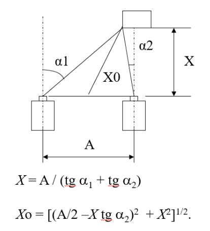
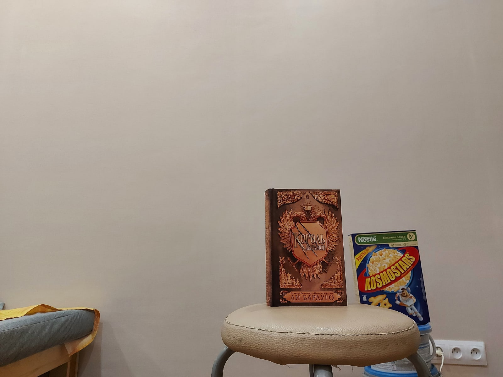
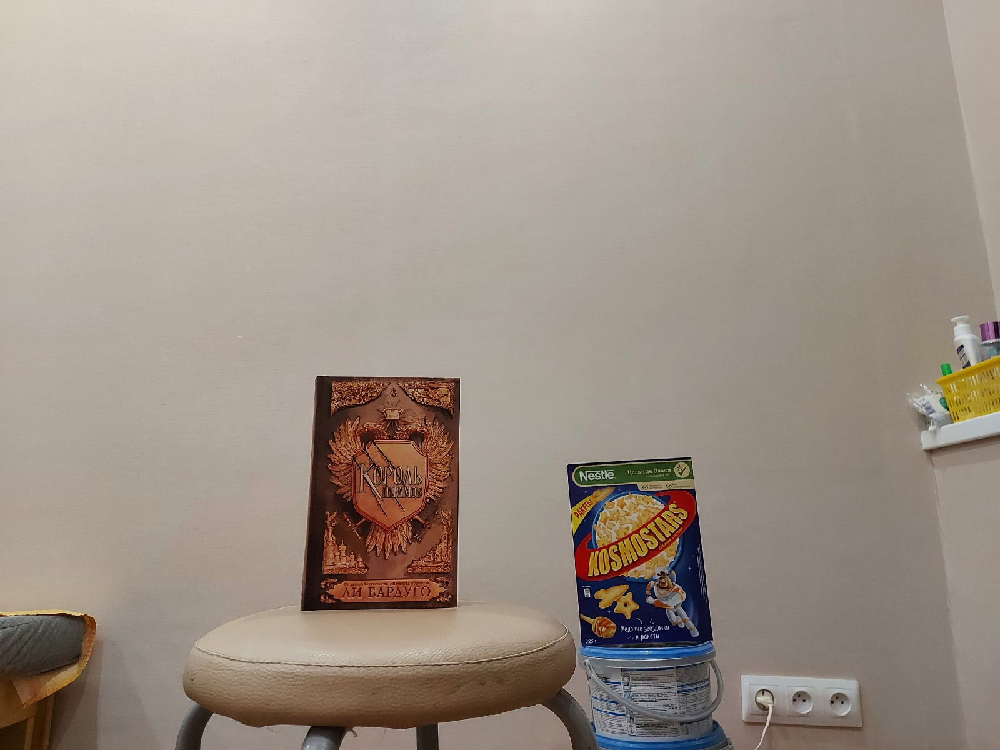
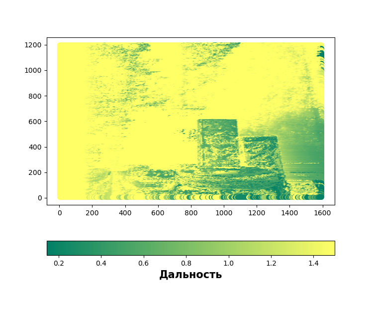

# Depth map stereo images

## Requirements
python3

matplotlib

cv2

tqdm

## Start

```python
import stereo

l = 'img/L.jpg'
r = 'img/R.jpg'

dm = stereo.depth_map(l, r, 5, 10)
dm.calc_depth_map()
dm.show_map()
```

## Description alg
Нахождение расстояния до точки основывается на формуле:


Поиск одной и той же точки на двух изображениях осуществляется с помощью корреляционной функции

### Исходные изображения




### Результат
